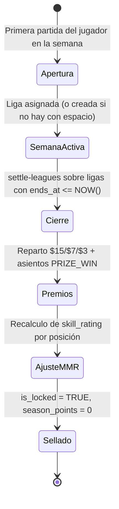

# 🏆 Motor de Micro-Ligas Semanales (`playwin-league-engine`)

> **Misión Fundamental:**
> Administrar la formación automática de grupos cerrados de 10 jugadores, el seguimiento de Season Points y el cálculo determinista de premios semanales y ajuste de MMR, sin intervención manual.

> ⚠️ **Esta skill fue reconciliada con el código real el 2026-09-29.** Todos los valores numéricos y nombres de columna están verificados contra `settle.ts` y `leagues.ts`. Donde el diseño objetivo difiere de lo implementado, se marca como **[PENDIENTE]**.

---

## 1. Principio Matemático: Dos Métricas Desacopladas

```
┌──────────────────────────────────────────────┐
│           PERFIL DE JUGADOR EN JUEGO         │
├──────────────────────────────────────────────┤
│ 1. SKILL RATING (MMR): [ 1200 - 3000 ]       │ ➔ Define contra quién juegas (Rango / División)
│    (Persistente, ajustado cada Domingo)      │ ➔ No se resetea a cero
├──────────────────────────────────────────────┤
│ 2. SEASON POINTS: [ 0 - ∞ ]                  │ ➔ Determina quién gana el premio de la semana
│    (Volátil, reinicio a 0 cada Lunes)        │ ➔ Se gana jugando partidas y logrando victorias
└──────────────────────────────────────────────┘
```

**Columnas reales:** `game_passports.skill_rating` (DEFAULT `1200`) y `game_passports.season_points` (DEFAULT `0`).

### 🔴 Regla crítica: un duelo NO mueve el MMR

El MMR se ajusta **una sola vez por semana**, al cerrar la temporada, según la **posición final en la liga de 10**. Una victoria o derrota individual solo otorga Season Points (+100 / +20); **no toca el `skill_rating`**.

> Esta distinción es doctrinal y está confirmada en el código: `matchService.recordMatch` actualiza `season_points` y el récord V/D, nunca `skill_rating`. Solo `settle.ts` escribe `skill_rating`.

---

## 2. Algoritmo Real de Sharding (Ligas de 10)

Implementado en `apps/hub/src/lib/db/leagues.ts`.

### `assignPlayerToLeague(userId, gameId, rankTier = 'BRONZE')`

1. **Verifica si el jugador ya está en una liga abierta** de ese juego (`is_locked = FALSE`). Si sí, devuelve esa liga y **no hace nada más** (garantiza la inmutabilidad de grupo).
2. Si no, busca una liga abierta:
   ```sql
   WHERE g.game_id = $1 AND g.rank_tier = $2 AND g.is_locked = FALSE
   GROUP BY g.id HAVING COUNT(m.user_id) < 10
   ORDER BY g.created_at ASC LIMIT 1
   ```
3. Si no encuentra ninguna con espacio, **crea una nueva** con `prize_pool = 25.00`, `starts_at = NOW()` y `ends_at = NOW() + 7 días`.
4. Inserta al jugador en `league_members` con `season_points = 0` y `position = 10`.

### 📌 Cómo funciona de verdad el sellado del grupo

**No hay lock distribuido, ni Redis, ni sellado automático al llegar a 10.**

- La exclusión de ligas llenas se logra con `HAVING COUNT(m.user_id) < 10` — es decir, **la propia consulta** impide que entre el jugador #11.
- `is_locked` **solo se pone en `TRUE` al cerrar la temporada** (`settle.ts:124`). Nunca al llegar a 10 miembros.
- La concurrencia se resuelve con una transacción PostgreSQL (`withTransaction`), no con un lock externo.

> ⚠️ **Riesgo de carrera conocido:** dos jugadores concurrentes podrían leer la misma liga con 9 miembros y ambos insertarse, creando una liga de 11. No hay `SELECT ... FOR UPDATE` ni constraint que lo impida. Ver `AUDITORIA_BUGS.md`.

### 🔴 El sharding por MMR NO está implementado

`rankTier` tiene valor por defecto **`'BRONZE'`** y **ningún llamador lo calcula a partir del `skill_rating`**. En la práctica:

- Todo jugador nuevo entra a una liga **BRONZE**, sin importar su MMR.
- No existe una función que traduzca `skill_rating` → `rank_tier`.
- Los umbrales de división (Bronce/Plata/Oro/…) **no están definidos en ninguna parte del código**.

📋 **[PENDIENTE]** — Esta es la pieza más importante que falta del motor de ligas: la función de mapeo MMR → división.

---

## 3. Cronograma Semanal Automatizado



### Disparador real

`POST /api/cron/settle-leagues` (protegido por `CRON_SECRET`) → `settleEngine.settleExpiredLeagues()`.

Selecciona las ligas con **`ends_at <= NOW()`**. No hay una ventana de temporada fija Lunes–Domingo en el código: los `starts_at`/`ends_at` se generan **relativos a la creación de cada liga** (`NOW()` + 7 días). La doctrina de "Lunes a Domingo UTC" es el objetivo de producto, no una restricción implementada.

📋 **[PENDIENTE]** La creación de liga escribe `season_number = 1` **fijo**. No hay incremento de temporada ni orquestador de apertura semanal.

---

## 4. Matriz Real de Premios y MMR

Valores **exactos** aplicados en `apps/hub/src/lib/db/settle.ts:54-69`. Bolsa por liga: **$25.00 USD**.

| Posición Final | Premio | Δ MMR | Asiento contable |
| :---: | :---: | :---: | :--- |
| **🥇 1º** | **$15.00** | **+60** | `PRIZE_WIN` |
| **🥈 2º** | **$7.00** | **+35** | `PRIZE_WIN` |
| **🥉 3º** | **$3.00** | **+20** | `PRIZE_WIN` |
| **4º al 7º** | Sin premio | **0** | — |
| **8º al 9º** | Sin premio | **−25** | — |
| **10º** | Sin premio | **−50** | — |

Estos son valores **fijos y deterministas**, no rangos. El desempate de posiciones usa `ORDER BY season_points DESC, joined_at ASC` (quien se unió antes gana el empate).

`provider_tx_id` del premio: `prize_{leagueId}_{userId}` con `ON CONFLICT DO NOTHING` → re-ejecutar la liquidación **no duplica pagos**.

Al cerrar, además se pone `season_points = 0` para todos los miembros y `is_locked = TRUE` en la liga.

> 📌 El reparto **no** escala por división todavía. Las bolsas por rango (Bronce $5 → Elite $250) del `info.negocio.md` son el objetivo de producto: hoy **todas** las ligas valen $25.

---

## 5. Puntuación de Partida (no confundir con MMR)

| Resultado del duelo | Season Points | Efecto en MMR |
| :--- | :---: | :--- |
| 🥇 Victoria | **+100** | **Ninguno** |
| 🥈 Derrota | **+20** | **Ninguno** |
| 🚪 Abandono / Rendición | **0** | **Ninguno** |
| 🚫 Descalificación por trampa | **0** | **Ninguno** |

El MMR **solo** se mueve en el cierre semanal (sección 4).

---

## 6. Reglas Inviolables

1. **Inmutabilidad de grupo.**
   Un jugador nunca puede ser transferido a otra liga durante la semana. El código lo garantiza en el primer paso de `assignPlayerToLeague`: si ya está en una liga abierta de ese juego, se devuelve esa y se aborta.

2. **Atomicidad en premios.**
   La dispersión del cierre debe ser una transacción atómica en PostgreSQL respaldada por el libro contable inmutable **`wallet_ledger`**.
   > 📌 La tabla real es `wallet_ledger`. **No existe `ledger_entries`.**

3. **Determinismo del reparto.**
   El `provider_tx_id` del premio es determinista y la inserción usa `ON CONFLICT DO NOTHING`. La liquidación debe ser **idempotente**: ejecutarla dos veces jamás paga dos veces.

4. **Un duelo nunca mueve el MMR.**
   Solo `settle.ts` escribe `skill_rating`. Cualquier otra escritura es un bug.

5. **Los nombres de columna son sagrados.**
   `league_groups.rank_tier` (NO `tier`) · `wallet_ledger.type` (NO `entry_type`). Este error ya causó el BUG-004.

---

## 7. Fuera de Alcance · Diseño Objetivo No Implementado

> **No asumas que esto existe.** Verificado: **cero referencias a Redis en todo el repositorio.**

| Capacidad | Estado |
| :--- | :--- |
| **Caché Redis para rankings** (`ZREVRANGE`, < 10ms) | ❌ No implementado. Los standings se calculan con un `ROW_NUMBER() OVER` en PostgreSQL en cada consulta. |
| **Lock distribuido en Redis al sellar el grupo** | ❌ No implementado. Se usa `HAVING COUNT < 10` + transacción. |
| **Mapeo `skill_rating` → `rank_tier`** | ❌ No implementado. Todo entra como `BRONZE`. |
| **Sellado automático al llegar a 10 miembros** | ❌ No implementado. `is_locked` solo cambia en el cierre semanal. |
| **Incremento de `season_number`** | ❌ No implementado. Se escribe `1` fijo. |
| **Bolsas escaladas por división** | ❌ No implementado. Todas las ligas valen $25. |
| **Ventana fija Lunes–Domingo UTC** | ❌ No implementado. `ends_at` es relativo a la creación de cada liga. |
| **Ascensos y descensos de división** | ❌ El MMR se ajusta, pero **no hay lógica que cambie el `rank_tier`** según umbrales. |

---

## 📋 Registro de Correcciones (2026-09-29)

| Corrección | Antes (incorrecto) | Ahora (verificado) |
| :--- | :--- | :--- |
| Δ MMR TOP 1 | "+50 a +80" | **`+60` fijo** |
| Δ MMR TOP 2 | "+30 a +45" | **`+35` fijo** |
| Δ MMR TOP 3 | "+15 a +25" | **`+20` fijo** |
| Δ MMR 4º–7º | "−5 a +5" | **`0` fijo** |
| Δ MMR 8º–9º | "−20 a −35" | **`−25` fijo** |
| Δ MMR 10º | "−40 a −60" | **`−50` fijo** |
| Premios | "Premio Mayor / Secundario / Menor" | **`$15.00` / `$7.00` / `$3.00`** sobre bolsa de $25 |
| Sellado del grupo | "se sella con `isLocked = true` mediante lock en Redis" | **Falso.** `HAVING COUNT < 10`; `is_locked` solo en el cierre |
| Sharding por MMR | "consulta su Skill Rating e identifica el RankTier" | **Falso.** Todo entra como `BRONZE`; el mapeo no existe |
| Caché de rankings | "Redis `ZREVRANGE` < 10ms" | **Falso.** `ROW_NUMBER()` en PostgreSQL |
| Tabla contable | `ledger_entries` | **`wallet_ledger`** |
| Ventana semanal | "Lunes 00:00 → Domingo 23:59 UTC" | **Relativa**: `NOW()` + 7 días por liga |
| Columna de división | `tier` | **`rank_tier`** |
