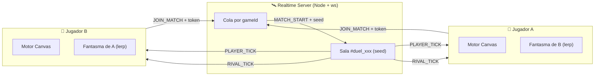

# ⚔️ Servidor de Duelos en Tiempo Real (`playwin-realtime-duels`)

> **Misión Fundamental:**
> Orquestar el emparejamiento instantáneo de dos jugadores, sincronizar la semilla determinista del nivel para que ambos compitan con idénticos obstáculos y retransmitir los estados de movimiento (Ghosts) a 20Hz sin sobrecargar el servidor.

> ⚠️ **Esta skill fue reconciliada con el código real el 2026-09-29.** Todos los eventos, tiempos y límites están verificados contra `apps/realtime-server/src/`. Donde el diseño objetivo difiere de lo implementado, se marca como **[PENDIENTE]**.

**Implementación nativa con `ws`** (sin Fastify ni Colyseus). Archivos:

| Archivo | Responsabilidad |
| :--- | :--- |
| `src/server.js` (91L) | HTTP + WebSocket en `/ws` · endpoint `/health` |
| `src/rooms.js` (340L) | `RoomManager`: colas, árbitro, reconexión, descalificación |
| `src/anticheat.js` (289L) | Física, firmas, colusión, rate limit |
| `src/room-factory.js` (71L) | Creación de salas de duelo y de ghost |
| `src/ghost-bot.js` (171L) | Simulador de rivales de división |
| `src/match-reconnect.js` (75L) | Ventana de gracia |

---

## 1. Arquitectura de Salas 1v1



### Emparejamiento real (cómo funciona de verdad)

- **La cola está indexada por `gameId` únicamente.** `this.waitingQueues = new Map()` se llena con `gameId` como clave.
- 🔴 **NO existe filtro por MMR.** No hay "MMR ± 100" ni ventana de habilidad: cualquier jugador del mismo juego se empareja con el primero disponible.
- **Ventana para encontrar humano: 3.5 segundos.** Si nadie aparece, entra automáticamente un **Ghost Bot**.
- La semilla se genera como `Math.floor(Math.random() * 9000000) + 1000000` → rango `1.000.000`–`9.999.999`.
- Al crear la sala, ambos jugadores se persisten en PostgreSQL con `userService.ensureUser()` (así `match_records` nunca viola la clave foránea). Si la BD falla, el duelo continúa de todos modos.

### Máquina de estados de la sala

```
WAITING → COUNTDOWN (3s) → PLAYING → FINISHED
```

El campo `status` vive en la sala; el paso de `COUNTDOWN` a `PLAYING` ocurre en un `setTimeout` de **3000 ms** que hace `broadcast` de `MATCH_LIVE` e iguala los timestamps de ambos jugadores (`room.liveAt`).

---

## 2. Generación Determinista de Pista (PRNG Seed)

Para garantizar una competición 100% basada en habilidad:

1. El servidor genera la semilla de 32 bits.
2. Ambos clientes la reciben **idéntica** en `MATCH_START`.
3. Cada juego inicializa **Mulberry32** con esa semilla.
4. **Resultado:** asteroides en *Space*, curvas y conos en *Carreras*, brechas en *Sky* y tuberías en *Flapy* aparecen en exactamente las mismas coordenadas para ambos jugadores.

> ✅ **Verificado end-to-end:** dos clientes con `MatchTicket` firmado recibieron `seed=9323438` idéntica y el servidor emitió `MATCH_END`.

### Rechazo de paquetes inválidos

El servidor valida cada tick con `validateTickPhysics()`. Si detecta salto de posición o incremento de score imposible, **descarta el paquete y acumula un strike**. A los 2 strikes, o ante una violación `HIGH`, expulsa al jugador. Los límites por juego están en `GAME_PHYSICS_BOUNDS` (ver `playwin-game-bridge` → sección 6).

**Rate limit:** máximo **35 paquetes/segundo** por jugador (`validatePacketRate`). Superarlo → `PACKET_FLOOD_ANOMALY`.

---

## 3. Protocolo Unificado de WebSocket

**Conexión:** `ws://<host>:3001/ws` · **Health:** `GET /health`

### Acciones del cliente → servidor

| `action` | Payload | Efecto |
| :--- | :--- | :--- |
| `JOIN_MATCH` | `{ player: { token, gameId } }` | **`token` OBLIGATORIO.** Sin él → `SECURITY_ERROR`. |
| `PLAYER_TICK` | `{ x, y, score, isAlive }` | Telemetría a 20Hz. Validada por el anti-cheat. |
| `PLAYER_CRASHED` | `{}` | Reporta choque. **En carreras se delega a `handlePlayerFinish`.** |
| `PLAYER_FINISH` | `{ score }` | Fin de partida. Decide la victoria por distancia. |
| `PING` | `{ clientTime }` | Mide RTT. |

### Eventos servidor → cliente

| `event` | Payload | Significado |
| :--- | :--- | :--- |
| `SECURITY_ERROR` | `{ message }` | Token ausente, inválido o expirado. |
| `SECURITY_WARNING` | `{ message }` | Emparejamiento bloqueado por colusión. |
| `MATCH_WAITING` | `{ gameId, message }` | En cola esperando rival. |
| `MATCH_START` | `{ roomId, seed, role, player, opponent }` | Rival encontrado. Arranca el conteo visual de 3s. |
| `MATCH_LIVE` | `{}` | **Fin del countdown: arranca el bucle del juego.** |
| `RIVAL_TICK` | `{ x, y, score, isAlive }` | Estado del rival (para el fantasma). |
| `MATCH_RESUME` | `{ roomId, seed, status, role, player, opponent }` | Reconexión exitosa. |
| `RIVAL_DISCONNECTED` | `{ graceSeconds: 15, message }` | El rival se cayó. |
| `RIVAL_RECONNECTED` | `{ message }` | El rival volvió. |
| `MATCH_END` | `{ winnerId, loserId, reason, summary, payout }` | **Veredicto final inmutable.** |
| `PONG` | `{ clientTime, time }` | Respuesta a PING. |

### Forma de `MATCH_END`

```json
{
  "event": "MATCH_END",
  "winnerId": "usr_7721",
  "loserId": "usr_3310",
  "reason": "HIGHER_SCORE",
  "summary": "carlos_pro ganó con 109m.",
  "payout": { "winnerSeasonPoints": 100, "loserSeasonPoints": 20 }
}
```

**Valores de `reason` realmente emitidos:**

| `reason` | Cuándo |
| :--- | :--- |
| `HIGHER_SCORE` | Victoria por mayor distancia/puntaje (`_resolveScoreWinner`) |
| `OPPONENT_CRASH` | El rival chocó (flapy, space, sky) |
| `FORFEIT` | No reconectó dentro de los 15s |
| `SPEEDHACK_SCORE_OVERFLOW` · `TELEPORT_POSITION_ANOMALY` · `OUT_OF_BOUNDS_ANOMALY` · `SCORE_RETROGRADE_ANOMALY` · `PACKET_FLOOD_ANOMALY` | Descalificación por anti-cheat (0 puntos al infractor) |

> 📌 `SURVIVOR` y `CHEATING` están declarados en el diseño pero **no se emiten**. Los reales son los de arriba.

---

## 4. Rivales de División (Ghost Bots)

Para evitar colas infinitas, tras **3.5 segundos** sin rival humano entra un **Ghost Bot**.

- Son **5 rivales predefinidos** (`DIVISION_RIVALS`) con UUIDs fijos válidos: `carlos_pro`, `alex_pro`, `valkyria_99`, `titan_speed`, `novato_esports`.
- **Se persisten como usuarios reales** en PostgreSQL vía `ensureUser` — no son fantasmas en la BD.
- La simulación corre a **100 ms por tick (10Hz)** y **emite `RIVAL_TICK`**, así que el cliente los dibuja igual que a un humano.
- En partidas ghost, el perdedor recibe **0 puntos** (`p2PointsDelta: 0`) para no inflar Season Points regalados.

### Comportamiento por juego (real)

| Juego | Inicio | Fallo humano simulado |
| :--- | :--- | :--- |
| **carreras** | `progress += 5.7/tick` → ~57/s | Termina a los `2600` de score o `42s` |
| **flapy-flapy** | `score = elapsed * 1.25`, `x = 60` fijo | Tras **22 puntos**, 0.7% de probabilidad por tick de chocar |
| **sky** | `progress += 1.8/tick` | Tras **320m**, 0.6% de probabilidad de caída |
| **space** | `progress += 28/tick` → ~280 pts/s | Tras **35s**, 0.6% de impacto letal |

---

## 5. Reconexión y Tolerancia a Fallos

### Ventana de gracia: **15 segundos**

> ⚠️ **Corrección importante:** esta skill decía antes *"5 segundos"*. El valor real es **`15000 ms`**, definido en `new ReconnectManager(15000)` (`rooms.js:15`) y anunciado al rival como `graceSeconds: 15`.

El propósito de los 15s es permitir **recargar el navegador con F5** y volver sin perder la partida.

### Flujo de desconexión

1. El socket se cierra durante `COUNTDOWN` o `PLAYING`.
2. El rival recibe `RIVAL_DISCONNECTED` con `graceSeconds: 15`.
3. Se programa el `FORFEIT` a los 15s.
4. **Si es partida ghost**, la simulación se **pausa** (`ghostSimulation.pause()`) para no penalizar al usuario, y se **reanuda** al volver.

### Flujo de reconexión

Al reconectar con el mismo `JOIN_MATCH`, el servidor resuelve la identidad por **`id` o `username`** (vía `ReconnectManager.isPending`) y:

1. Reasigna el socket a la sala existente.
2. Emite **`MATCH_RESUME`** con el estado real (score propio y del rival).
3. Notifica al rival con `RIVAL_RECONNECTED`.
4. Como respaldo, recorre las salas buscando una `COUNTDOWN`/`PLAYING` donde el jugador ya figure (cubre el caso de perder el registro de reconexión).

**Protección anti-duplicado:** si el jugador ya está en una sala activa, el servidor **prohíbe** crear o buscar partidas nuevas.

### Persistencia en el Hub

El Hub guarda la arena en curso en `sessionStorage` para restaurarla tras el refresco, y el SDK reactiva el bucle con `onMatchLive({ seed, isResume: true })`.

> ✅ **Nota sobre el ticket:** el `MatchTicket` **no** es de un solo uso, precisamente para que la reconexión funcione. Ver `playwin-auth-passport` → sección 7.

---

## 6. Reglas Inviolables

1. **El Servidor es la Fuente de la Verdad.**
   El cliente jamás decide quién ganó; solo notifica sus propios eventos (choque o fin).

2. **Ventana de gracia de 15 segundos.**
   Ni 5 ni 30. Está en `ReconnectManager` y se anuncia al rival en `graceSeconds`.

3. **Interpolación Lineal en el Cliente (Lerp).**
   El renderizado del fantasma debe interpolar entre los dos últimos paquetes (el SDK lo hace a 60Hz con factor `0.28`). No dibujes el fantasma con la posición cruda del último tick.

4. **Validación Anti-Cheat obligatoria en cada tick.**
   Ningún tick se retransmite sin pasar por `validateTickPhysics` y `validatePacketRate`.

5. **Determinismo absoluto.**
   Nunca generes obstáculos en el cliente con `Math.random()`. Todo sale de la semilla del servidor con Mulberry32.

6. **El token manda sobre la identidad.**
   `rooms.js` sobrescribe `id`, `username`, `avatar` y `gameId` con los claims verificados del `MatchTicket`. Ignora lo que diga el cliente.

7. **Carreras se resuelve por distancia, no por choque.**
   `PLAYER_CRASHED` en carreras **delega** a `PLAYER_FINISH`. Nunca marques perdedor por choque en carreras: premiaría al piloto rezagado.

8. **El puerto debe ser inyectable.**
   `server.js` ya lee `process.env.PORT`, pero **nada carga el `.env`** en este workspace. Al escribir tests, arranca el servidor en un puerto libre explícito para no colisionar (ver `AUDITORIA_BUGS.md` → BUG-016).

---

## 7. Fuera de Alcance · Diseño Objetivo No Implementado

| Capacidad | Estado |
| :--- | :--- |
| **Matchmaking por MMR (± 100)** | ❌ **No existe.** La cola filtra solo por `gameId`. |
| **Colyseus / Fastify** | ❌ Se usa `ws` nativo sobre `node:http`. |
| **Caché Redis de salas o rankings** | ❌ Cero referencias a Redis en el repositorio. |
| **Reintento/revancha en la misma sala** | ⚠️ El botón `SIGUIENTE DUELO` vuelve a la cola; la sala vieja se marca `FINISHED` y se limpia a los 6s. |
| **Espectadores** | ❌ No implementado. |
| **Anti-colusión activa en desarrollo** | ⚠️ `detectCollusion` solo actúa con `NODE_ENV === 'production'`, y en dev se permite emparejar dos pestañas del mismo usuario. |

---

## 📋 Registro de Correcciones (2026-09-29)

| Corrección | Antes (incorrecto) | Ahora (verificado) |
| :--- | :--- | :--- |
| Ventana de gracia | **5 segundos** | **15 segundos** (`ReconnectManager(15000)`) |
| Matchmaker | "Cola de espera (MMR ± 100)" | **Solo filtra por `gameId`**; sin ventana de habilidad |
| Stack técnico | "Fastify + WS" / "Colyseus" | **`node:http` + `ws` nativo** |
| Valores de `reason` | `SURVIVOR`, `HIGHER_SCORE`, `OPPONENT_CRASH`, `FORFEIT`, `CHEATING` | **`HIGHER_SCORE`, `OPPONENT_CRASH`, `FORFEIT`** + las razones de anomalía del anti-cheat. `SURVIVOR`/`CHEATING` no se emiten |
| Ghost Bots | No documentado | 5 rivales fijos, **persistidos en BD**, simulación a **10Hz**, ventana de **3.5s** |
| Rate limit | No documentado | **35 paquetes/s** por jugador |
| Reconexión ghost | No documentada | La simulación se **pausa** durante la desconexión y se reanuda |
| Resolución en carreras | No documentada | Victoria por **distancia**; el choque **no** hace perder |
| Ocultamiento del HUD | No documentado | El SDK lo hace solo; los juegos no deben dibujar HUD de puntuación |
| Comentario del código | `match-reconnect.js:4` decía "5s de gracia" | **Corregido a 15s** (la skill vieja había contaminado el comentario) |

### Efecto colateral corregido en el código

```diff
- * Gobernado por playwin-realtime-duels (Regla 2: 5s de gracia) y AGENTS.md
+ * Gobernado por playwin-realtime-duels (Regla 2: 15s de gracia) y AGENTS.md
```
`apps/realtime-server/src/match-reconnect.js:4`
