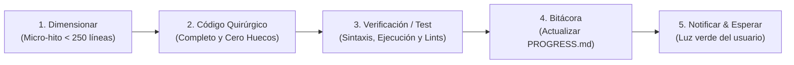

# 🔬 Pipeline de Ejecución Quirúrgica y Pruebas (`playwin-surgical-pipeline`)

> **Propósito Fundamental:**  
> Frenar el impulso de la IA de generar código masivo incompleto ("huecos" o código recortado). Obligar a trabajar en micro-hitos estrictamente delimitados, verificando cada archivo con pruebas y registrando el avance en `PROGRESS.md` antes de avanzar al siguiente módulo.

---

## 🛑 El Bucle de 5 Pasos Obligatorio

Cada tarea técnica solicitada debe ejecutarse siguiendo este ciclo determinista:

---

## 📋 Las 5 Reglas del Pipeline

### 1. Dimensionar y Fraccionar (Micro-Hitos Atómicos)
* **Regla:** Nunca intentar construir un sistema entero en una sola respuesta.
* Se debe definir un objetivo único y concreto (ej. *"Hoy solo construimos el módulo WebSocket del Servidor 1v1 y su handshake"*).
* Cada archivo creado o editado debe mantenerse en el rango de **100 a 300 líneas**.

### 2. Cero Huecos o Ahorro de Tokens (Zero-Gap Integrity)
* La IA tiene **terminantemente prohibido**:
  * Dejar comentarios de relleno: `// ... el resto de la lógica sigue aquí`.
  * Crear métodos con retornos falsos: `return null; // TODO implementar`.
  * Simular funcionalidades clave sin conectarlas a las funciones reales.
* Todo lo que se escriba debe estar **completo y listo para producción**.

### 3. Verificación y Pruebas Obligatorias
* Antes de dar por terminado un hito:
  * Ejecutar comandos de compilación o linter (`npm run build`, `tsc --noEmit`, scripts de prueba en `scratch/`).
  * Si es código de frontend o HTML5, verificar que no existan variables nulas o errores de carga en consola.
  * Si hay errores, se corrigen inmediatamente antes de tocar cualquier otro archivo.

### 4. Bitácora de Progreso (`PROGRESS.md`)
* En la raíz del proyecto existirá el archivo `PROGRESS.md`.
* Al finalizar cada micro-hito, la IA debe registrar:
  * **Hito Completado:** Qué se implementó con enlaces a los archivos.
  * **Estado de Verificación:** Resultado de las pruebas ejecutadas.
  * **Decisiones Técnicas:** Contratos o variables establecidas.
  * **Siguiente Hito Inmediato:** Cuál es el siguiente paso lógico.
* Al arrancar el siguiente turno, **la IA está obligada a leer `PROGRESS.md`** para retomar el hilo con precisión quirúrgica sin inventar nada nuevo.

### 5. Notificación y Pausa
* Al culminar el hito, la IA no continúa sola a ciegas.
* Presenta al usuario un resumen conciso de lo logrado y solicita confirmación para arrancar el siguiente hito.
