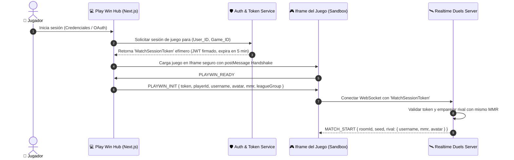

# 🎮 PLAY WIN — DIRECTRICES Y PROTOCOLOS DEL EQUIPO DE AGENTES (AGENTS.md)

Este documento define las reglas operativas, arquitectura de software y estándares de ingeniería para el desarrollo de la plataforma eSports **Play Win**. Todos los agentes y asistentes que operen en este repositorio deben cumplir estrictamente estas directrices.

---

## 🏛️ 1. Principios Fundamentales del Ecosistema

1. **Desacoplamiento Absoluto de Juegos (Game-Agnostic Core):**  
   La plataforma nunca debe conocer la lógica interna ni las variables privadas de los juegos. Toda comunicación con cualquier juego (actual o futuro) se realiza de forma estricta mediante el **PlayWin Game Bridge SDK** vía `window.postMessage` cifrado/firmado y eventos tipados.
2. **Cero Código Flojo o Elipsis:**  
   Todo código entregado debe estar completo y listo para producción. Queda prohibido el uso de `// TODO: implementar luego`, `/* resto del código igual */`, o funciones simuladas sin lógica real.
3. **Seguridad y Anti-Cheat por Diseño (Zero Client Trust):**  
   Nunca se confía en el puntaje directo que envía el navegador del cliente. Cada partida requiere un `matchToken` firmado por el backend antes de iniciar; el cliente reporta telemetría (duración, eventos de input, estado por frame) que el servidor valida antes de acreditar Season Points o dinero.
4. **Arquitectura Limpia y Tipado Estricto:**  
   - Frontend: Next.js (TypeScript) + Vanilla CSS / CSS Modules de autor con diseño Cyber-eSports.
   - Backend: Node.js / Fastify con WebSockets nativos (`ws` / `Colyseus`).
   - Persistencia: PostgreSQL (modelos relacionales y ledger financiero) + Redis (sorted sets para ligas de 10 y locks de temporada).
   - Cero uso de `any` en TypeScript.

---

## 🤖 2. Matriz de Skills Especializadas del Proyecto (`.agents/skills/`)

Para asegurar la especialización y evitar dependencias cruzadas desordenadas, el desarrollo se organiza en las siguientes 8 skills del proyecto:

```
.agents/
└── skills/
    ├── playwin-surgical-pipeline/ # Micro-hitos atómicos, pruebas, cero huecos y bitácora PROGRESS.md
    ├── playwin-code-governance/   # Límite < 350 líneas, cero lógica en front, cero estilos inventados
    ├── playwin-game-bridge/       # Protocolo del SDK y adaptador universal de juegos
    ├── playwin-league-engine/     # Ligas de 10, MMR, Season Points y ciclo semanal
    ├── playwin-realtime-duels/    # Servidor WebSockets de salas 1v1, semillas PRNG y ghosts
    ├── playwin-auth-passport/     # Auth JWT, sesiones efímeras para juegos y pasaporte eSports
    ├── playwin-billing-treasury/  # Whop API, PayPal Checkout & Payouts y Ledger contable
    └── playwin-ui-experience/     # Sistema de diseño Warm Editorial Tangerine y Motion UI
```

---

## 🔐 3. Flujo de Identidad e Inyección en los Juegos

Para resolver cómo el usuario logueado en la plataforma entra a jugar con sus datos reales:



1. **El juego corre en un `<iframe>` aislado y seguro**: Con directivas `sandbox="allow-scripts allow-same-origin"`.
2. **Handshake PostMessage seguro:** El Hub envía los datos del jugador (alias, avatar, MMR actual, token de sesión) directamente al iframe.
3. **El juego nunca almacena claves secretas:** Solo utiliza el token efímero que dura el tiempo de la partida.

---

## 🎨 4. Directrices de Estilo Visual (UI/UX Warm Editorial Tangerine)

El Hub de Play Win adopta la estética de alta gama **Warm Editorial / Tangerine Luxury**:
- **Paleta Cromática Oficial:**
  - Fondos orgánicos: `--bg: #dcdcdb`, `--hero-bg-1: #edecea`, `--hero-bg-2: #c8c7c5`, `--card: #f2f1ee`.
  - Tintas: `--ink: #0c0c0e`, `--ink-soft: #2a2a2d`, `--mute: #8a8780`, `--line: #dad6ce`.
  - Acentos Tangerine eSports: `--orange: #d2691a`, `--orange-2: #bb570f`.
  - Píldoras: `--pill-dark: #0c0c0e`, `--pill-light: #e8e7e4`.
- **Textura y Acabado:** Capa de grano analógico mate (`SVG fractalNoise`) con opacidad al 4% sobre tarjetas Hero con `border-radius: 28px`.
- **Navegación:** Barra de píldora flotante (`border-radius: 999px`) con enlaces activos circulares y reloj de temporada en tiempo real.
- **Tipografía:** `Inter` (700/800 para títulos, 500/600 para lectura y botones), reservando `Orbitron` exclusivamente para HUDs de marcadores en partida.
- **Botones Píldora 3D:** Biseles interiores (`inset 0 1px 0 rgba(255,255,255,0.9)`), sombras de profundidad y rotación de icono en hover.

---

## 💳 5. Finanzas y Pagos (Whop + PayPal)

1. **Whop (Pasarela Primaria):** Gestión de suscripciones recurrentes, pases de temporada y acceso a ligas premium con validación estricta de webhooks vía firma HMAC.
2. **PayPal (Pasarela Secundaria & Retiros):**
   - Compras directas de créditos vía PayPal Checkout.
   - Dispersión automática de premios semanales a ganadores mediante **PayPal Payouts API** tras validación de auditoría anti-cheat.
3. **Doble Libro Contable (Ledger):** Toda entrada y salida se registra atómicamente en PostgreSQL en la tabla `wallet_ledger`.

---

## 📁 6. Estructura de Directorios del Repositorio

```
Play Win/
├── AGENTS.md                          # Este archivo maestro de directrices
├── ARQUITECTURA_SISTEMA_ESPORTS.md   # Especificación de arquitectura general
├── info.negocio.md                   # Modelo de negocio y reglas de competición
├── .agents/
│   └── skills/                       # Skills operativas para desarrollo
│       ├── playwin-code-governance/  # Límite < 350 líneas, cero lógica en front, cero estilos inventados
│       ├── playwin-game-bridge/      # SDK universal de integración de juegos
│       ├── playwin-league-engine/    # Ligas de 10, MMR y ciclo semanal
│       ├── playwin-realtime-duels/   # WebSockets 1v1, semillas PRNG y ghosts
│       ├── playwin-auth-passport/    # Identidad, sesiones efímeras y pasaporte
│       ├── playwin-billing-treasury/ # Whop + PayPal y ledger inmutable
│       └── playwin-ui-experience/    # Tokens Warm Editorial Tangerine
├── apps/
│   ├── hub/                          # Frontend Next.js (Dashboard, Ligas, Perfil)
│   └── realtime-server/              # Backend Fastify + WebSockets (Salas y Duelos)
├── packages/
│   ├── game-sdk/                     # SDK universal inyectable en juegos (@playwin/bridge)
│   ├── database/                     # Esquemas PostgreSQL (Drizzle/Prisma) y Redis
│   └── types/                        # Contratos e interfaces TypeScript compartidas
└── games/
    ├── space/                        # Shmup Arcade adaptado a SDK
    ├── carreras/                     # 3D Racing adaptado a SDK
    ├── sky/                          # Sky Runner adaptado a SDK
    └── flapy-flapy/                  # Precision Tapper adaptado a SDK
```

---

## 🛡️ 7. Gobernanza de Código y Prevención de Errores de IA

Todo agente o asistente que genere o modifique código en este repositorio debe acatar estas 5 reglas obligatorias:

1. **Límite Estricto de Tamaño (< 350 Líneas Estándar, Techo Máximo de 800 Líneas):**  
   Ningún módulo estándar puede superar las **350 líneas**. Componentes extendidos y orquestadores centrales (como SDK, routers o engines) tienen un techo máximo e infranqueable de **800 líneas**. Los motores de juego legacy (`public/games/`) quedan estrictamente congelados contra el engorde (cero código inflado; solo micro-edits quirúrgicos).
2. **Cero Lógica Crítica, Secretos o Mutación en el Frontend (Zero Client Trust & Tamper Protection):**  
   Queda terminantemente prohibido calcular dinero, premios, validar cuotas/stock, decidir victorias o quemar claves secretas en el cliente. El frontend es **únicamente una capa de presentación y captura de eventos**. Toda API expuesta (`window.PlayWin`) debe estar sellada con `Object.freeze()` y devolver copias inmutables de su estado.
3. **Cero Estilos Asumidos o Inventados:**  
   Prohibido usar colores directos como `#ffffff`, `#000000`, o clases ajenas. Todo elemento visual debe emplear exclusivamente los tokens oficiales de `--bg`, `--card`, `--ink`, `--orange` definidos en `playwin-ui-experience`.
4. **Cero Código Isla (Conexión Obligatoria con lo Existente):**  
   Antes de escribir una función utilitaria o cliente HTTP, se debe buscar en `packages/` o `lib/` para reutilizarlo.
5. **Cero Elipsis:**  
   Prohibido entregar código con `// TODO:`, `// resto del código igual`, o métodos vacíos.

---

## 🧭 8. Matriz de Enrutamiento de Skills (Routing Table)

Antes de realizar cualquier acción técnica, el agente debe activar y seguir las directrices de la skill correspondiente:

| Tarea a Realizar | Skill Obligatoria | Directiva Clave |
| :--- | :--- | :--- |
| **Diseñar o maquetar componentes, vistas o páginas del Hub** | `playwin-ui-experience` | Seguir tokens Warm Editorial Tangerine, grano mate, pills 3D y responsive. |
| **Modificar o conectar un videojuego (Iframe, menús, HUDs)** | `playwin-game-bridge` | Quitar pausas locales, implementar el ciclo de 4 pantallas y bus `postMessage`. |
| **Programar WebSockets, salas 1v1 o sincronización de rivales** | `playwin-realtime-duels` | Generar semilla PRNG idéntica, ticks a 20Hz, ghosts transparentes y servidor como árbitro. |
| **Implementar Auth, Login, Pasaporte del jugador o Tokens** | `playwin-auth-passport` | Usar tokens efímeros `MatchTicket` (5 min); desacoplar sesión maestra del juego. |
| **Integrar pasarelas de pago, saldo, pases o retiros de premios** | `playwin-billing-treasury` | Webhooks HMAC de Whop, PayPal Payouts API y doble asiento en `wallet_ledger`. |
| **Gestionar temporadas semanales, sharding de 10 o cálculo de MMR** | `playwin-league-engine` | Desacoplar Season Points de MMR, locks atómicos en Redis y ciclo Lunes-Domingo. |
| **Crear archivos nuevos, refactorizar o validar arquitectura** | `playwin-code-governance` | Respetar el límite de < 350 líneas, cero lógica crítica en front y cero estilos inventados. |
| **Planificar tareas, verificar código y registrar avances** | `playwin-surgical-pipeline` | Fraccionar en micro-hitos < 250 líneas, cero elipsis, pruebas y bitácora `PROGRESS.md`. |
