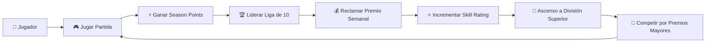
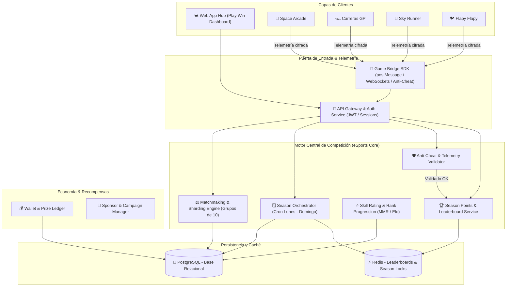
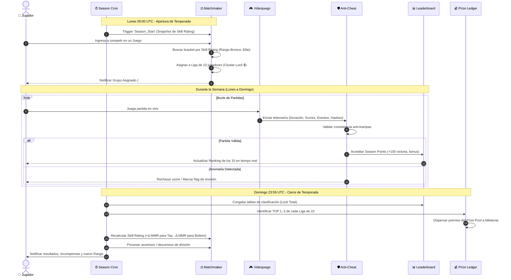
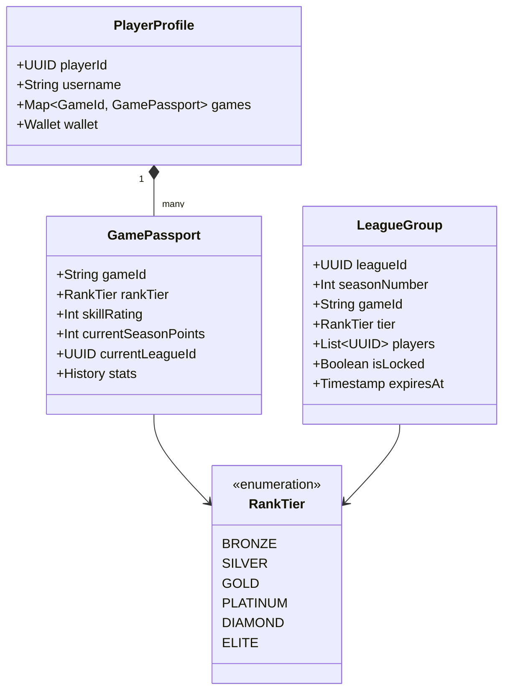
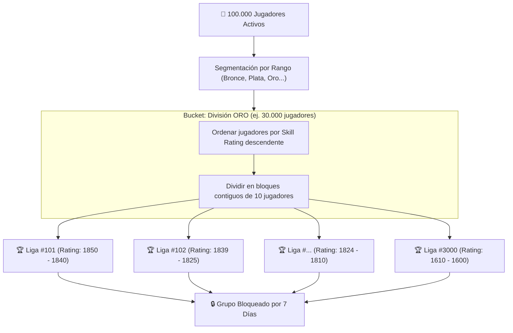
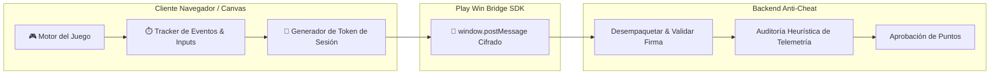
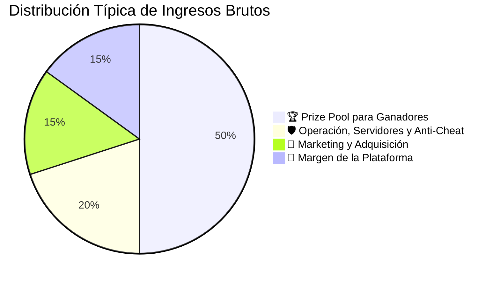
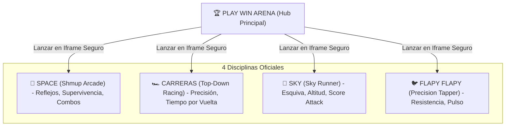
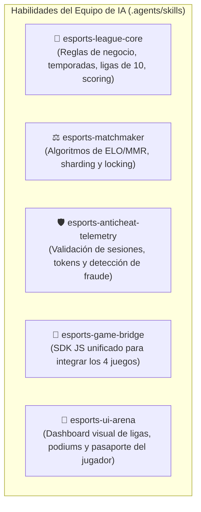

# 🎮 PLAY WIN — ESPECIFICACIÓN DE ARQUITECTURA TÉCNICA Y DE NEGOCIO
**Plataforma Global de Competición eSports Basada en Micro-Ligas Semanales**
*Versión:* 1.0.0 | *Fecha:* 2026-09-28 | *Estado:* Arquitectura Base para Desarrollo de Skills e Implementación

---

## 📌 1. Resumen Ejecutivo y Visión

**Play Win** transforma la competición de videojuegos eliminando la frustración del "Torneo Masivo Único" (donde miles compiten y el 99.9% pierde el interés en 24 horas). 

El sistema implementa un **motor de micro-ligas semanales cerradas de 10 jugadores**, emparejados por habilidad matemática (**Skill Rating / MMR**), compitiendo por **Puntos de Temporada (Season Points)** para obtener premios directos, subir de división y desbloquear premios mayores en temporadas futuras.

---

## 🏗️ 2. Arquitectura de Alto Nivel del Ecosistema

La plataforma desacopla completamente el **Catálogo de Videojuegos** del **Motor de Competición**, permitiendo integrar desde juegos HTML5 ligeros locales (`sky`, `carreras`, `flapy flapy`, `space`) hasta videojuegos de terceros vía API.

---

## 🔄 3. Ciclo de Vida Semanal Automatizado (The Weekly Loop)

Cada temporada es una máquina de estados determinista que inicia el **Lunes 00:00 UTC** y finaliza el **Domingo 23:59 UTC**.

---

## ⚖️ 4. Doble Motor: Season Points vs. Skill Rating

Uno de los pilares fundamentales del modelo de negocio es la separación conceptual entre el **Esfuerzo Semanal** y el **Nivel de Destreza Real**:

### Tabla Comparativa de Motores

| Dimensión | 🏆 Season Points (Puntos de Temporada) | ⭐ Skill Rating / MMR (Habilidad) |
| :--- | :--- | :--- |
| **Propósito** | Determinar quién gana la liga **esta semana**. | Determinar contra quién juegas la **próxima temporada**. |
| **Persistencia** | Se reinicia a **0** cada lunes. | Se mantiene y ajusta semanalmente según resultados. |
| **Cómo se gana** | Jugando partidas, logrando victorias, combos y objetivos. | Rendimiento relativo frente a los 9 rivales de grupo. |
| **Recompensa** | Premio en efectivo/créditos de la semana. | Ascenso de categoría (ej. de Oro a Platino) y mayor bolsa. |
| **Psicología** | Grind activo, adrenalina de carrera corta. | Prestigio, estatus competitivo, maestría a largo plazo. |

---

## 🎯 5. Motor de Sharding y Formación de Ligas (Grupos de 10)

Cuando hay 100.000 jugadores en un juego, el sistema ejecuta un algoritmo de agrupamiento por proximidad de Skill Rating:

### Reglas de Bloqueo y Asignación Dinámica:
1. **Asignación en Primera Partida:** Si un jugador no inicia la semana inmediatamente el lunes, ingresa en el momento en que inicia su primera partida dentro de un grupo abierto de su mismo rango.
2. **Capacidad Máxima 10:** Tan pronto el jugador #10 entra, el grupo se sella con `isLocked = true`.
3. **Anti-Desertion:** Ningún jugador puede transferirse de liga a mitad de semana para evitar cazar grupos con puntajes bajos.

---

## 🛡️ 6. Sistema Anti-Trampas y Telemetría de Juegos

Para los juegos web actuales (`sky`, `carreras`, `flapy flapy`, `space`) y juegos integrados vía web, la plataforma no confía en el puntaje enviado por el cliente. Se utiliza un canal de telemetría de eventos:

### Reglas del Validador Anti-Cheat:
* **Duración vs. Score:** Verificación de que la relación `Score / Tiempo_de_juego` no exceda los límites matemáticos del motor del juego.
* **Frecuencia de Inputs:** Detección de patrones de botting (clics equidistantes al milisegundo en Flapy o aceleración antinatural en Carreras).
* **Nonce de Sesión:** Cada partida solicita un `matchToken` firmado por el backend antes de iniciar; el resultado debe reportarse con ese token único dentro de una ventana de expiración.

---

## 💰 7. Modelo Financiero y Distribución de Premios

El modelo opera bajo el estándar legal de **Competición basada en Habilidad (Skill-Based Gaming)**:

### Fuentes de Alimentación del Prize Pool:
1. **Patrocinios Corporativos:** Marcas patrocinan ligas completas (ej. *Copa Red Bull Space League*).
2. **Suscripción Premium ($4.99/mes):** Estadísticas avanzadas, insignias cosméticas, ligas exclusivas sin ventaja competitiva directa (no Pay-To-Win).
3. **Monetización Publicitaria No Invasiva:** Recompensas de visualización opcional y banners perimetrales en torneos.

### Escalado de Premios por División:
$$\text{Premio Top 1} \propto \text{Rango} \times \text{Factor de Dificultad}$$

* 🥉 **Bronce:** Bolsa pequeña / Premios formativos ($5).
* 🥈 **Plata:** Bolsa media ($10).
* 🥇 **Oro:** Bolsa competitiva ($25).
* 💠 **Platino:** Bolsa avanzada ($50).
* 💎 **Diamante:** Bolsa profesional ($100).
* 👑 **Elite:** Supercopa / Gran Premio ($250+).

---

## 🎮 8. Integración Directa con los 4 Juegos Existentes

Los juegos alojados en el repositorio se integran como las primeras cuatro disciplinas oficiales de Play Win:

Cada juego compartirá el **SDK Común `playwin-bridge.js`**:
* Notificación de inicio de partida: `PLAY_WIN_MATCH_START`.
* Notificación de progreso/telemetría: `PLAY_WIN_TELEMETRY`.
* Notificación de fin de partida y score: `PLAY_WIN_MATCH_RESULT`.
* Retorno a la arena: `PLAY_WIN_CLOSE_ARENA`.

---

## 🤖 9. Ecosistema de Skills para el Equipo de IA

Para construir este sistema con rigor y calidad de producción, dividiremos el trabajo en **Skills de Agentes Especializados** organizados en `.agents/skills/`:

### Detalle de Skills a Crear:
1. `esports-league-core`: Gestiona el ciclo semanal, máquinas de estados (Lunes-Domingo), cálculo de Season Points y orquestación de ascensos/descensos.
2. `esports-matchmaker`: Algoritmo de clustering de 10 jugadores basado en Skill Rating y gestión de slots.
3. `esports-anticheat-telemetry`: Cifrado, tokens de sesión y heurísticas para validar partidas sin confiar ciegamente en el cliente.
4. `esports-game-bridge`: Módulo universal inyectable en `space`, `carreras`, `sky` y `flapy flapy`.
5. `esports-ui-arena`: Interfaz web moderna con estética eSports competitiva (tablas de posiciones en tiempo real, perfil con pasaporte multijuego y modal de juego).

---

## ✅ 10. Conclusión y Próximos Pasos

Con este documento maestro de arquitectura:
1. Tenemos la base formal de datos, flujos de negocio y seguridad.
2. Procederemos a empaquetar las **Skills** correspondientes para que los asistentes de IA ejecuten cada componente con estándares de ingeniería de software.
