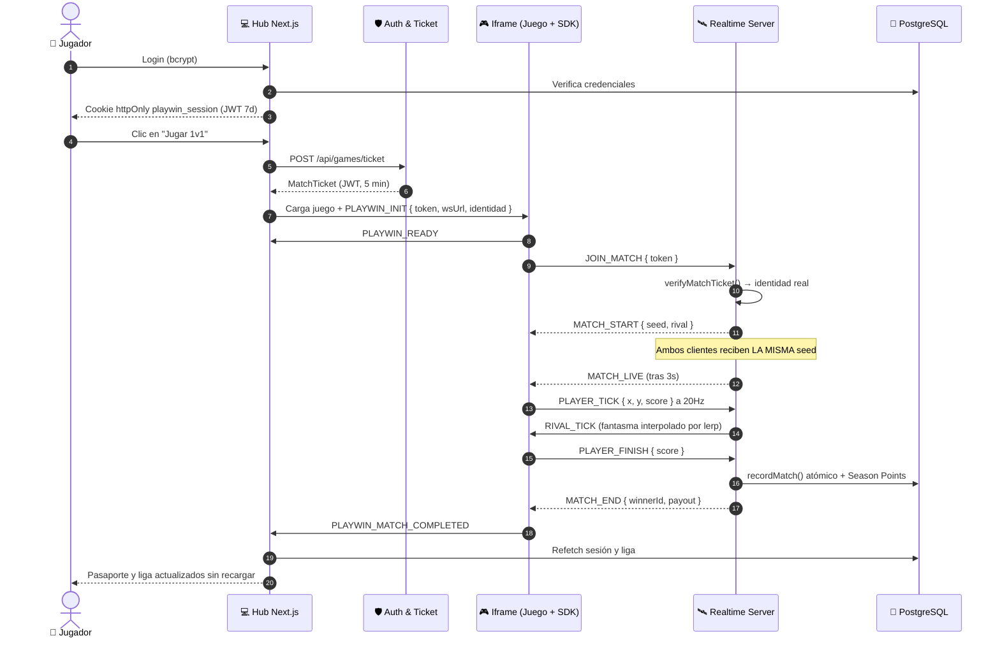

# 🎮 PLAY WIN — DOCUMENTACIÓN MAESTRA DEL PROYECTO

> **Propósito de este documento:**
> Este archivo es el **punto de entrada obligatorio** para cualquier agente de IA o desarrollador que se incorpore al proyecto. Contiene el objetivo del negocio, la arquitectura, los **contratos técnicos exactos** (eventos, endpoints, esquema de datos) y el estado real verificado del código.
>
> **Regla de oro:** Si algo está documentado aquí, no necesitas volver a leer el código para saberlo. Si algo NO está aquí, léelo en el código antes de asumirlo.
>
> *Última auditoría integral:* 2026-09-29 · *Método:* lectura de código + ejecución real de suites y de una partida 1v1 completa contra el servidor.

**Documentos hermanos:**

| Documento | Contenido |
| :--- | :--- |
| [AUDITORIA_BUGS.md](AUDITORIA_BUGS.md) | Los 18 bugs abiertos, con `archivo:línea`, evidencia y arreglo propuesto |
| [PROGRESS.md](PROGRESS.md) | Bitácora de hitos separada entre `VERIFICADO` / `REPORTADO` / `DESMENTIDO` |
| [AGENTS.md](AGENTS.md) | Directrices maestras y tabla de enrutamiento de skills |

---

## 📑 Índice

1. [Objetivo del Producto](#1-objetivo-del-producto)
2. [Modelo de Competición (Las Reglas del Juego)](#2-modelo-de-competición)
3. [Modelo de Negocio](#3-modelo-de-negocio)
4. [Arquitectura del Sistema](#4-arquitectura-del-sistema)
5. [Mapa de Directorios](#5-mapa-de-directorios)
6. [Contratos Técnicos Verificados](#6-contratos-técnicos-verificados)
7. [Flujos End-to-End](#7-flujos-end-to-end)
8. [Sistema Anti-Cheat y Zero Client Trust](#8-sistema-anti-cheat-y-zero-client-trust)
9. [Sistema de Diseño Visual](#9-sistema-de-diseño-visual)
10. [Gobernanza de Código (Las 5 Reglas)](#10-gobernanza-de-código)
11. [Entorno, Configuración y Comandos](#11-entorno-configuración-y-comandos)
12. [Estado Real Verificado](#12-estado-real-verificado)
13. [Deuda Técnica Conocida](#13-deuda-técnica-conocida)
14. [Hoja de Ruta](#14-hoja-de-ruta)

---

## 1. Objetivo del Producto

**Play Win** es una plataforma global de competición eSports donde cualquier jugador puede competir semanalmente, subir de rango y ganar premios económicos.

**La diferencia fundamental frente a un torneo tradicional:**
No existe un único torneo gigante donde miles compiten y el 99.9% pierde el interés en 24 horas. Play Win crea automáticamente **miles de micro-competiciones semanales cerradas de 10 jugadores**, organizadas por nivel de habilidad.

**El ciclo de retención (el corazón del producto):**

```
Nueva semana ➔ Nueva liga ➔ Nuevo objetivo ➔ Nueva oportunidad de ganar
```

> *"No estamos creando una página de torneos. Estamos creando una liga mundial permanente para videojuegos."*

**La métrica fundamental del MVP:** que una persona entre el lunes y el domingo quiera volver porque quiere ganar su liga.

---

## 2. Modelo de Competición

### 2.1 El ciclo semanal (Lunes 00:00 → Domingo 23:59 UTC)

| Momento | Qué ocurre |
| :--- | :--- |
| **Lunes** | Apertura de temporada. Los jugadores se agrupan por Skill Rating en ligas de 10. |
| **Durante la semana** | El jugador compite en duelos 1v1 y acumula Season Points. El ranking del grupo se actualiza en tiempo real. |
| **Domingo 23:59** | Congelación total. Se identifican los TOP 1–3 de cada liga, se dispersan premios, se recalcula el Skill Rating y se procesan ascensos/descensos. |
| **Lunes siguiente** | Todo comienza de nuevo con grupos reformados. |

### 2.2 Los dos motores independientes (concepto clave)

Este es el pilar del modelo. **Nunca deben confundirse ni acoplarse:**

| Dimensión | 🏆 Season Points | ⭐ Skill Rating (MMR) |
| :--- | :--- | :--- |
| **Propósito** | Quién gana la liga **esta semana** | Contra quién juegas la **próxima** semana |
| **Persistencia** | Se reinicia a **0** cada lunes | Persiste y se ajusta semanalmente |
| **Cómo se gana** | Jugando y ganando partidas | Rendimiento relativo frente a los 9 rivales |
| **Recompensa** | Premio en efectivo de la semana | Ascenso de división y bolsas mayores |
| **Psicología** | Grind activo, adrenalina de carrera corta | Prestigio, estatus, maestría a largo plazo |

### 2.3 Puntuación universal (fase 1)

| Resultado | Puntos |
| :--- | :--- |
| **Victoria** | +100 |
| **Derrota** | +20 |
| **Abandono / Desconexión** | 0 |
| **Descalificación por fraude** | 0 |

*Objetivo a futuro: MVP +25, Objetivo +10, con valores dependientes de cada juego.*

### 2.4 Ajuste de MMR al cierre de temporada

Aplicado según la posición final del jugador dentro de su liga de 10:

| Posición | Δ MMR |
| :--- | :--- |
| TOP 1 | +60 |
| TOP 2 | +35 |
| TOP 3 | +20 |
| Posiciones 4–7 | 0 |
| Posiciones 8–9 | −25 |
| Posición 10 | −50 |

### 2.5 Divisiones y premios semanales

| División | Bolsa TOP 1 (concepto) |
| :--- | :--- |
| 🥉 BRONZE | $5 |
| 🥈 SILVER | $10 |
| 🥇 GOLD | $25 |
| 💠 PLATINUM | $50 |
| 💎 DIAMOND | $100 |
| 👑 ELITE | $250+ |

### 2.6 Reparto de la bolsa por liga (implementado)

Cada liga de 10 tiene una bolsa de **$25.00 USD** repartida así:

| Posición | Premio |
| :--- | :--- |
| 🥇 1º | $15.00 |
| 🥈 2º | $7.00 |
| 🥉 3º | $3.00 |

### 2.7 Reglas de bloqueo y asignación

1. **Asignación en la primera partida:** si el jugador no empieza el lunes, entra en el momento de su primera partida en un grupo abierto de su mismo rango.
2. **Capacidad máxima 10:** cuando entra el jugador #10, el grupo se sella con `is_locked = true`.
3. **Anti-deserción:** nadie puede transferirse de liga a mitad de semana. Esto evita cazar grupos con puntajes bajos.
4. **Amigos:** pueden ser amigos, pero **no pueden elegir estar en la misma liga**. El matchmaking sigue siendo automático para evitar manipulación.

---

## 3. Modelo de Negocio

### 3.1 Fuentes de ingreso

| Fuente | Descripción |
| :--- | :--- |
| **Patrocinadores** | Una marca financia parte de los premios de una liga y obtiene exposición (ej. *Copa Red Bull Weekly Challenge*). |
| **Publicidad** | Anuncios, banners y eventos especiales **no invasivos**, sin destruir la experiencia. |
| **Suscripción Premium** | $4.99/mes: estadísticas avanzadas, historial completo, insignias, personalización. **Nunca ventaja competitiva directa (no Pay-To-Win).** |
| **Eventos especiales** | Copas patrocinadas de fin de semana con bolsas mayores (ej. $10.000). |
| **Marketplace (futuro)** | Skins, cosméticos, badges, productos digitales. |

### 3.2 De dónde sale el dinero de los premios (decisión de diseño crítica)

**El modelo NO depende de que los jugadores paguen para ganar.** Se descarta explícitamente la estructura *"100 jugadores pagan $1 y uno recibe $100"*, porque puede caer en categorías regulatorias de concursos/apuestas según la jurisdicción.

```
Publicidad + Patrocinios + Premium + Eventos financiados + Ingresos comerciales
                                    ↓
                              PRIZE POOL
                                    ↓
                                Premios
```

Distribución típica de ingresos brutos:

| Destino | % |
| :--- | :--- |
| 🏆 Prize Pool para ganadores | 50 |
| 🛡️ Operación, servidores y anti-cheat | 20 |
| 📢 Marketing y adquisición | 15 |
| 💼 Margen de la plataforma | 15 |

> ⚠️ **Advertencia legal registrada en el diseño original:** la estructura financiera y legal debe revisarse país por país antes del lanzamiento. El estándar adoptado es **competición basada en habilidad (Skill-Based Gaming)**.

### 3.3 Pasarelas de pago

| Pasarela | Rol |
| :--- | :--- |
| **Whop** | Pasarela **primaria**. Suscripciones recurrentes, pases de temporada, acceso a ligas premium. Validación por webhook con firma HMAC. |
| **PayPal** | Pasarela **secundaria**. Compras de créditos vía Checkout y **dispersión automática de premios** vía Payouts API tras auditoría anti-cheat. |

**Doble libro contable:** toda entrada y salida se registra atómicamente en la tabla `wallet_ledger`. El saldo del usuario (`users.wallet_balance`) solo se mueve dentro de la misma transacción ACID que inserta el asiento.

### 3.4 La visión a gran escala

```
                        PLATAFORMA
                             │
        ┌────────────────────┼────────────────────┐
        │                    │                    │
    VALORANT                 FC               FORTNITE
        │                    │                    │
    1M players             500K                 2M
        │                    │                    │
      Ligas                Ligas                Ligas
        │                    │                    │
        🏆                   🏆                   🏆
```

Cada juego tiene su **propio sistema competitivo independiente** (un jugador puede ser Diamante en un juego y Bronce en otro), y dentro de cada rango existen miles de grupos: Grupo 1, Grupo 2, ... Grupo 100.000. Esto permite crecer sin cambiar la mecánica fundamental.

---

## 4. Arquitectura del Sistema

### 4.1 Principio rector: Desacoplamiento Absoluto de Juegos

La plataforma **nunca** conoce la lógica interna ni las variables privadas de los juegos. Toda comunicación con cualquier juego (actual o futuro) ocurre estrictamente mediante el **PlayWin Game Bridge SDK** vía `window.postMessage` + WebSocket con eventos tipados.

### 4.2 Diagrama de capas

```
┌──────────────────────────────────────────────────────────────────┐
│ CAPA DE CLIENTES                                                 │
│  Hub Web (Next.js)  ·  Space  ·  Carreras  ·  Sky  ·  Flapy      │
│  (los 4 juegos corren en <iframe> sandboxed same-origin)         │
└───────────────────────────────┬──────────────────────────────────┘
                                │ postMessage (handshake) + WS
┌───────────────────────────────▼──────────────────────────────────┐
│ GAME BRIDGE SDK (packages/game-sdk/playwin-bridge.js)            │
│  Handshake · 4 pantallas · ticks 20Hz · ghosts · anti-pausa      │
└───────────────────────────────┬──────────────────────────────────┘
                                │
┌───────────────────────────────▼──────────────────────────────────┐
│ MOTOR CENTRAL DE COMPETICIÓN (eSports Core)                      │
│  ┌────────────────┐ ┌────────────────┐ ┌──────────────────────┐  │
│  │ Matchmaking &  │ │ Season         │ │ Skill Rating & Rank  │  │
│  │ Sharding (10)  │ │ Orchestrator   │ │ Progression (MMR)    │  │
│  └────────────────┘ └────────────────┘ └──────────────────────┘  │
│  ┌────────────────┐ ┌────────────────┐                           │
│  │ Season Points  │ │ Anti-Cheat &   │                           │
│  │ & Leaderboard  │ │ Telemetry      │                           │
│  └────────────────┘ └────────────────┘                           │
└───────┬──────────────────────────────────┬───────────────────────┘
        │                                  │
┌───────▼────────┐              ┌──────────▼───────────────────────┐
│ ECONOMÍA       │              │ PERSISTENCIA                     │
│ Wallet Ledger  │              │ PostgreSQL (Neon Serverless)     │
│ Sponsor/Campaign│             │ Redis (ligas, season locks)*     │
└────────────────┘              └──────────────────────────────────┘

* Redis está especificado en la arquitectura objetivo pero AÚN NO implementado.
```

### 4.3 Decisiones arquitectónicas ya tomadas

| Decisión | Detalle |
| :--- | :--- |
| **Juegos en same-origin** | Los 4 juegos y el SDK se sirven desde `apps/hub/public/` (Next.js). Se eliminó el servidor estático Python `:8080` que se usaba antes. |
| **WebSocket URL inyectada** | El Hub inyecta `NEXT_PUBLIC_REALTIME_WS_URL` al iframe vía handshake postMessage. Permite desplegar el servidor WS en cualquier host sin hardcoding. |
| **Cero servidores secundarios** | Todo se sirve desde Next.js salvo el servidor de duelos WebSocket. |
| **Ghost Bots con usuario real** | Los rivales de división se persisten como usuarios reales en la BD (`ensureUser`) para que `match_records` no viole claves foráneas. |

---

## 5. Mapa de Directorios

```
Play Win/
├── AGENTS.md                          # Directrices maestras y tabla de enrutamiento de skills
├── DOCUMENTACION_PROYECTO.md          # ← ESTE ARCHIVO. Contexto completo del proyecto
├── AUDITORIA_BUGS.md                  # Registro vivo de bugs y deuda técnica
├── PROGRESS.md                        # Bitácora de hitos y estado de avance
├── ARQUITECTURA_SISTEMA_ESPORTS.md    # Especificación original de arquitectura (doc histórico)
├── info.negocio.md                    # Modelo de negocio original (doc histórico)
├── .env                               # Variables de entorno reales (GITIGNORED)
├── .env.example                       # Plantilla de variables de entorno
├── .agents/skills/                    # 8 skills operativas para agentes de IA
│
├── apps/
│   ├── hub/                           # Frontend Next.js 16.3.6 + todas las API routes
│   │   ├── public/games/              # Los 4 motores de juego (LEGACY, congelados)
│   │   ├── public/game-sdk/           # Copia servida del bridge SDK
│   │   ├── src/app/                   # Páginas + API routes (App Router)
│   │   ├── src/components/            # 9 componentes de UI
│   │   ├── src/lib/                   # auth, email, y capa de datos
│   │   └── test/                      # Suites de integración del Hub
│   │
│   └── realtime-server/               # Backend de duelos (Node nativo + ws)
│       ├── src/server.js              # Servidor HTTP + WebSocket
│       ├── src/rooms.js               # RoomManager: colas, árbitro, reconexión
│       ├── src/anticheat.js           # Motor anti-cheat y verificación de tickets
│       ├── src/room-factory.js        # Creación de salas 1v1 y salas ghost
│       ├── src/ghost-bot.js           # Simulador de rivales de división
│       └── src/match-reconnect.js     # Ventana de gracia de reconexión
│
├── packages/
│   ├── database/                      # Esquema PostgreSQL + servicios de negocio
│   │   ├── src/schema.sql             # 6 tablas de producción
│   │   ├── src/services/              # users, passports, matches, leagues, ledger
│   │   └── src/migrate.js             # Migrador de esquema
│   ├── game-sdk/                      # SDK universal inyectable (@playwin/bridge)
│   └── types/                         # (declarado en AGENTS.md — NO existe todavía)
│
├── games/                             # (declarado en AGENTS.md — el código vive en apps/hub/public/games/)
│
├── scratch/                           # Scripts de verificación E2E y capturas (NO es producción)
└── test/
    └── code_protection_governance_test.mjs  # Suite de gobernanza (9 pruebas)
```

> 📌 **Nota de exactitud:** `packages/types/` y un directorio raíz `games/` aparecen en el `AGENTS.md` original pero **no existen** en el repositorio. Los motores de juego reales viven en `apps/hub/public/games/`.

---

## 6. Contratos Técnicos Verificados

> Esta sección es la de mayor valor: son los contratos exactos extraídos del código. **Respétalos al escribir código nuevo.**

### 6.1 Protocolo WebSocket (servidor de duelos)

**Conexión:** `ws://<host>:3001/ws` (path `/ws`). Health check HTTP en `GET /health`.

**Formato:** JSON plano con un campo `action` (cliente→servidor) o `event` (servidor→cliente).

#### Acciones del cliente → servidor

| `action` | Payload | Efecto |
| :--- | :--- | :--- |
| `JOIN_MATCH` | `{ player: { token, gameId } }` | **El campo `token` es OBLIGATORIO** (MatchTicket firmado). Sin él → `SECURITY_ERROR`. |
| `PLAYER_TICK` | `{ x, y, score, isAlive }` | Telemetría a 20Hz. Validada por el motor anti-cheat. |
| `PLAYER_CRASHED` | `{}` | El jugador reporta choque. En `carreras` se delega a `PLAYER_FINISH`. |
| `PLAYER_FINISH` | `{ score }` | Fin de partida. Usado por carreras (victoria por distancia). |
| `PING` | `{ clientTime }` | Mide RTT. Respuesta `PONG`. |

#### Eventos servidor → cliente

| `event` | Payload | Significado |
| :--- | :--- | :--- |
| `SECURITY_ERROR` | `{ message }` | Token ausente, inválido o expirado. |
| `SECURITY_WARNING` | `{ message }` | Emparejamiento bloqueado por colusión. |
| `MATCH_WAITING` | `{ gameId, message }` | En cola esperando rival. |
| `MATCH_START` | `{ roomId, seed, role, player, opponent }` | Rival encontrado. Arranca countdown de **3 segundos**. `seed` es idéntica para ambos. |
| `MATCH_LIVE` | `{}` | Fin del countdown. El juego puede empezar a moverse. |
| `RIVAL_TICK` | `{ x, y, score, isAlive }` | Estado del rival (usar para el fantasma). |
| `MATCH_RESUME` | `{ roomId, seed, status, role, player, opponent }` | Reconexión exitosa dentro de la ventana de gracia. |
| `RIVAL_DISCONNECTED` | `{ graceSeconds: 15, message }` | El rival se cayó. |
| `RIVAL_RECONNECTED` | `{ message }` | El rival volvió. |
| `MATCH_END` | `{ winnerId, loserId, reason, summary, payout }` | **Veredicto final inmutable.** |
| `PONG` | `{ clientTime, time }` | Respuesta a PING. |

**Valores de `reason` en `MATCH_END`:** `SURVIVOR` · `HIGHER_SCORE` · `OPPONENT_CRASH` · `FORFEIT` · `CHEATING` (los cinco declarados en la skill; los implementados hoy son `HIGHER_SCORE`, `OPPONENT_CRASH`, `FORFEIT` y las razones de anomalía del anti-cheat).

**Forma del `payout`:**
```json
{ "winnerSeasonPoints": 100, "loserSeasonPoints": 20 }
```

### 6.2 Protocolo postMessage (Hub ↔ iframe del juego)

| Dirección | `type` | Payload | Cuándo |
| :--- | :--- | :--- | :--- |
| Juego → Hub | `PLAYWIN_READY` | — | El SDK se inicializó dentro del iframe. |
| Hub → Juego | `PLAYWIN_INIT` | `{ playerId, username, avatar, rank, skillRating, token, wsUrl, gameId }` | Respuesta al READY. Inyecta identidad y ticket. |
| Juego → Hub | `PLAYWIN_REQUEST_LOGIN` | — | El juego necesita sesión (no hay token). |
| Hub → Juego | `PLAYWIN_REQUIRE_LOGIN` | — | El Hub ordena mostrar la pantalla de auth. |
| Juego → Hub | `PLAYWIN_MATCH_COMPLETED` | `{ winnerId, isWin, payout }` | Al terminar la partida. Dispara el refresco del Hub. |
| Juego → Hub | `PLAYWIN_CLOSE_ARENA` | — | El usuario quiere volver al Hub. |

### 6.3 API del SDK `window.PlayWin`

**Sellado con `Object.freeze()`.** Variables internas (socket, semilla, estado) aisladas en clausura IIFE.

```javascript
window.PlayWin.init({
  gameId: 'carreras',                     // requerido
  callbacks: {
    onMatchReady({ seed, opponent }) {},  // rival encontrado, antes del countdown
    onMatchLive({ seed, isResume }) {},   // ¡ARRANCA EL JUEGO AQUÍ!
    onMatchEnd({ isWin, payout }) {}      // fin de partida
  }
});

window.PlayWin.startMatchmaking();        // entrar a la cola (o reconectar)
window.PlayWin.sendTick({ x, y, score, isAlive });  // telemetría, ~20Hz
window.PlayWin.notifyCrash();             // reportar choque
window.PlayWin.notifyFinish(score);       // reportar fin (carreras)
window.PlayWin.getOpponentState();        // → copia inmutable { x, y, score, isAlive }
window.PlayWin.getPlayer();               // → copia inmutable de la sesión
window.PlayWin.isLive();                  // → boolean
```

**Contrato crítico para los juegos:** el bucle de juego **NO debe arrancar** hasta que se invoque `callbacks.onMatchLive()`. El SDK inyecta automáticamente las 4 pantallas (Matchmaking, Versus 3-2-1, HUD en vivo, Resultado) y bloquea las teclas `Escape` / `P` para que el juego no se pueda pausar durante una partida.

### 6.4 Variables globales opcionales del SDK

| Variable | Default | Uso |
| :--- | :--- | :--- |
| `window.PLAYWIN_WS_URL` | `ws://localhost:3001/ws` | URL del servidor WS (el Hub la sobreescribe vía `PLAYWIN_INIT.wsUrl`). |
| `window.PLAYWIN_SDK_CSS_URL` | `/game-sdk/playwin-bridge.css` | Hoja de estilos del SDK. |

### 6.5 Esquema de base de datos (6 tablas)

```sql
users            (id UUID PK, username UNIQUE, email UNIQUE, password_hash,
                  avatar_url, global_level, has_premium, paypal_email,
                  wallet_balance NUMERIC(12,2), is_verified, verification_token,
                  reset_token, reset_token_expires_at, created_at, updated_at)

game_passports  (id UUID PK, user_id FK→users CASCADE, game_id,
                  rank_tier VARCHAR(16) DEFAULT 'BRONZE', skill_rating INT DEFAULT 1200,
                  season_points INT DEFAULT 0, total_matches, wins, losses, best_score,
                  updated_at, UNIQUE(user_id, game_id))

league_groups   (id UUID PK, season_number INT, game_id, rank_tier VARCHAR(16),
                  is_locked BOOLEAN, prize_pool NUMERIC(12,2) DEFAULT 25.00,
                  starts_at, ends_at, created_at)

league_members  (league_id FK→league_groups CASCADE, user_id FK→users CASCADE,
                  season_points INT, position INT, joined_at,
                  PRIMARY KEY(league_id, user_id))

match_records   (id UUID PK, room_id VARCHAR(64), game_id, player1_id FK→users,
                  player2_id FK→users, winner_id FK→users, p1_score, p2_score,
                  seed BIGINT, finish_reason VARCHAR(32), duration_ms, created_at)

wallet_ledger   (id UUID PK, user_id FK→users, amount NUMERIC(12,2), currency,
                  type VARCHAR(32), status VARCHAR(20), provider VARCHAR(20),
                  provider_tx_id VARCHAR(128) UNIQUE, metadata JSONB, created_at)
```

> ⚠️ **Nombres exactos de columnas — no los inventes:**
> `wallet_ledger.type` (NO `entry_type`) · `league_groups.rank_tier` (NO `tier`).
> Este error está cometido actualmente en `/api/admin/metrics` (ver [AUDITORIA_BUGS.md](AUDITORIA_BUGS.md) → BUG-004).

**Valores válidos en uso:**
- `rank_tier`: `BRONZE` · `SILVER` · `GOLD` · `PLATINUM` · `DIAMOND` · `ELITE`
- `wallet_ledger.type`: `DEPOSIT` · `PRIZE_WIN` · `WITHDRAWAL` · `ENTRY_FEE` · `WHOP_MEMBERSHIP_ACTIVATED`
- `wallet_ledger.provider`: `WHOP` · `PAYPAL` · `SYSTEM`
- `wallet_ledger.status`: `COMPLETED` · `PENDING` · `FAILED`

**Índices existentes:** `idx_passports_lookup`, `idx_passports_ranking`, `idx_leagues_season`, `idx_ledger_user`.

### 6.6 API del Hub (18 handlers)

| Ruta | Método | Auth | Función |
| :--- | :--- | :--- | :--- |
| `/api/auth/register` | POST | pública | Crea usuario, hashea con bcrypt, envía mails, crea 4 pasaportes + slot de liga, setea cookie. |
| `/api/auth/login` | POST | pública | Username **o** email + bcrypt. Setea cookie httpOnly `playwin_session` (JWT, 7d). |
| `/api/auth/me` | GET | cookie/Bearer | Usuario + todos sus pasaportes. Nunca devuelve 401 (retorna `authenticated:false`). |
| `/api/auth/me` | POST | — | Logout: borra la cookie. |
| `/api/auth/verify-email` | POST / GET | token en body/query | Marca `is_verified = true`. |
| `/api/auth/forgot-password` | POST | pública | Token hex de 64 chars, TTL 60 min, envía email. Respuesta genérica anti-enumeración. |
| `/api/auth/reset-password` | POST | token en body | Hashea la nueva contraseña y consume el token. |
| `/api/games/ticket` | POST | **sesión requerida** | Emite `MATCH_SESSION_TICKET` JWT de **5 minutos**. |
| `/api/games/lobby` | GET | pública | Detalle del juego + pilotos activos + reglas. |
| `/api/leagues` | GET | opcional | Liga del usuario, o standings de liga abierta para invitados. |
| `/api/matches/history` | GET | cookie/Bearer | Últimas 30 partidas reformateadas. |
| `/api/wallet/transactions` | GET | opcional | Últimos 30 asientos del ledger. Sin sesión → lista vacía con 200. |
| `/api/admin/metrics` | GET | **SIN AUTH** ⚠️ | Métricas de auditoría. **Roto y sin proteger** (BUG-001 / BUG-004). |
| `/api/cron/settle-leagues` | POST / GET | `CRON_SECRET` | Ejecuta la liquidación semanal de ligas. |
| `/api/payments/paypal/payout` | POST | **sesión + saldo ≥ $5** | Débito atómico + asiento `WITHDRAWAL`. **No llama a la API de PayPal todavía** (BUG-015). |
| `/api/webhooks/paypal` | POST | **SIN FIRMA** 🔴 | Acredita `DEPOSIT` en `PAYMENT.CAPTURE.COMPLETED`. **Vulnerabilidad crítica (BUG-001).** |
| `/api/webhooks/whop` | POST | HMAC condicional | Marca premium / registra depósito. **Validación eludible (BUG-005).** |

### 6.7 Autenticación (mecánica exacta)

- **Sesión maestra:** JWT HS256 firmado con `JWT_SECRET`, `expiresIn: '7d'`, guardado en cookie **httpOnly** llamada `playwin_session` (`sameSite: lax`).
- **Verificación por ruta:** **no existe middleware ni helper compartido.** Cada route handler relee la cookie con `cookies()` de `next/headers` y llama a `authLib.verifyToken()`. Muchas rutas aceptan también `Authorization: Bearer <token>`.
- **Token de partida:** `MATCH_SESSION_TICKET` JWT de 5 minutos, con claims `{ sub, username, avatar, gameId, type }`. Firmado con el **mismo** `JWT_SECRET`.
- **Verificación del token de partida:** ocurre en el servidor de duelos (`anticheat.js → verifyMatchTicket`), que recalcula la firma HMAC-SHA256 manualmente. **El juego nunca ve el secreto.**

### 6.8 Capa de datos

Existen **dos implementaciones paralelas** de la misma capa de datos (ver BUG-003):

| Ruta | Consumidor real |
| :--- | :--- |
| `packages/database/src/services/*.js` | **El servidor de duelos** (`@playwin/database`) y las suites de test. Es la capa viva. |
| `apps/hub/src/lib/db/*.ts` | Las API routes del Hub. Es una **copia duplicada**; `@playwin/database` está declarado como dependencia del Hub pero **nunca se importa**. |

Servicios disponibles (mismos nombres en ambas capas): `userService` · `passportService` · `matchService` · `leagueService` · `ledgerService` · `settleEngine`.

---

## 7. Flujos End-to-End

### 7.1 Flujo completo: del login a la partida 1v1



### 7.2 Emparejamiento y Ghost Bots

1. El jugador entra a la cola de su `gameId`.
2. Si hay otro jugador esperando → **duelo real**. Se crea la sala con semilla aleatoria de 32 bits.
3. Si **no** hay nadie en **3.5 segundos** → se inicia una **partida contra un Rival de División (Ghost Bot)** para evitar colas infinitas.
4. Los Ghost Bots son 5 rivales predefinidos (`DIVISION_RIVALS` en `ghost-bot.js`) que **se persisten como usuarios reales** en la BD vía `ensureUser`, con UUIDs fijos válidos, para que `match_records` no viole la clave foránea.

### 7.3 Determinismo (PRNG con semilla compartida)

Garantía de competición justa:

1. El servidor genera `seed = Math.floor(Math.random() * 9000000) + 1000000`.
2. Ambos clientes reciben la **misma** seed en `MATCH_START`.
3. Cada juego inicializa un generador **Mulberry32** con esa seed.
4. **Resultado:** los asteroides en *Space*, las curvas y conos en *Carreras*, las brechas en *Sky* y las tuberías en *Flapy* aparecen en exactamente las mismas coordenadas para ambos jugadores.

### 7.4 Reconexión (ventana de gracia de 15 segundos)

- Si un socket se cierra durante `COUNTDOWN` o `PLAYING`, el rival recibe `RIVAL_DISCONNECTED` con `graceSeconds: 15`.
- El jugador tiene **15 segundos** para volver (permite recargar el navegador con F5).
- Al reconectar con el mismo `id`/`username`, el servidor reasigna su socket y emite `MATCH_RESUME` con el estado real de la partida.
- **Contra Ghost Bots**, la simulación se **pausa** durante la desconexión para no penalizar al usuario, y se reanuda al volver.
- Si no reconecta a tiempo → `FORFEIT`: el rival gana +100 y el ausente recibe 0.
- El Hub persiste la arena en curso en `sessionStorage` para restaurarla tras un refresco.

### 7.5 Resolución de victoria por juego

| Juego | Criterio de victoria |
| :--- | :--- |
| **carreras** | **Mayor distancia recorrida** (`HIGHER_SCORE`). `PLAYER_CRASHED` se delega a `PLAYER_FINISH` para no castigar al piloto con más metros. |
| **flapy-flapy** | Supervivencia. Quien choca pierde (`OPPONENT_CRASH`). |
| **space** | Supervivencia. Quien choca pierde (`OPPONENT_CRASH`). Puntaje continuo validado. |
| **sky** | Supervivencia / mayor puntaje. Caída al abismo = choque. |

### 7.6 Liquidación semanal (`settleEngine`)

Se ejecuta vía `/api/cron/settle-leagues` sobre las ligas con `ends_at <= NOW()`:

1. Identifica el TOP 3 y acredita $15 / $7 / $3 en `wallet_ledger` + `users.wallet_balance`.
2. Recalcula el MMR persistente (+60/+35/+20/0/−25/−50).
3. Reinicia `season_points` a 0 para la temporada siguiente.
4. Sella la liga con `is_locked = true`.

---

## 8. Sistema Anti-Cheat y Zero Client Trust

### 8.1 Principio: el servidor es el único árbitro

**Nunca** se confía en el puntaje que envía el navegador. El cliente **solo** reporta sus propios eventos; el servidor decide victorias y acredita puntos.

### 8.2 Los 4 vectores de defensa implementados

| # | Vector | Mecanismo |
| :--- | :--- | :--- |
| 1 | **Suplantación de identidad** | El juego solo recibe un `matchToken` efímero (5 min, HMAC-SHA256). Las credenciales y secretos nunca tocan el cliente. |
| 2 | **Inyección SQL / XSS** | Todas las consultas usan parámetros `$1, $2`. Sanitización de inputs de texto. |
| 3 | **Fuerza bruta y DoS** | Rate limiter en rutas de auth (10 intentos/IP/min) y rate limiter de paquetes WS (máx. 35/s por jugador). |
| 4 | **Integridad contable** | Transacciones ACID en `wallet_ledger` + constraint `UNIQUE` en `provider_tx_id` para idempotencia de webhooks. |

### 8.3 Límites físicos por juego (`GAME_PHYSICS_BOUNDS`)

| Juego | Puntaje | Límite de puntaje | Salto de posición | Límites espaciales |
| :--- | :--- | :--- | :--- | :--- |
| **carreras** | Continuo (m/s) | 2.500/s | 800 px | `maxPlayerX: 2200` |
| **flapy-flapy** | Discreto (+1/tubería) | 1.25/s, ráfaga máx 2 | 350 px | `minY: -25`, `maxY: 575`, `x` fija en 88 (±45) |
| **space** | Continuo | 15.000/s | 1.200 px | `maxPlayerX: 2800`, `maxPlayerY: 1600` |
| **sky** | Continuo | 100/s | 500 px | — |

**Sistema de 3 strikes:** violaciones `MEDIUM` acumulan `cheatStrikes`; a los 2 strikes o ante una violación `HIGH` → `PLAYER_DISQUALIFIED` (derrota por fraude, 0 puntos de liga, registro de auditoría en BD).

### 8.4 Otras defensas

- **Rate limit de paquetes:** máximo 35 paquetes/segundo por jugador (`PACKET_FLOOD_ANOMALY`).
- **Anti-sybil / colusión:** `detectCollusion()` bloquea el emparejamiento si es la misma cuenta o la misma IP (en producción).
- **Anti-pausa:** el SDK intercepta `Escape` y `P` durante la partida para impedir pausar el juego.
- **Blindaje del SDK:** `Object.freeze(window.PlayWin)`; `getPlayer()` y `getOpponentState()` retornan copias inmutables.

### 8.5 Amenazas identificadas y aún no resueltas

| Amenaza | Descripción | Estado |
| :--- | :--- | :--- |
| **Smurfing** | Un jugador pro crea una cuenta nueva para entrar a Bronce. | ❌ Sin mitigación. |
| **Boosting** | Jugadores fuertes ayudan artificialmente a otro. | ❌ Sin mitigación. |
| **Collusion** | Dos o más jugadores coordinan resultados. | ⚠️ Parcial (misma IP/cuenta). |
| **Cuentas múltiples** | Un usuario con varias cuentas. | ❌ Sin mitigación. |
| **Bots / macros** | Automatización de inputs. | ⚠️ Parcial (rate limit + física). |

---

## 9. Sistema de Diseño Visual

**Estética oficial: Warm Editorial / Tangerine Luxury.** Alta gama, apergaminada, con acentos Tangerine eSports.

### 9.1 Tokens cromáticos oficiales

> 🔒 **Regla inviolable:** queda prohibido usar colores HEX arbitrarios (`#ffffff`, `#000000`, `#3b82f6`). Usa **exclusivamente** estas variables.

```css
/* Fondos orgánicos */
--bg: #dcdcdb;
--hero-bg-1: #edecea;
--hero-bg-2: #c8c7c5;
--card: #f2f1ee;

/* Tintas */
--ink: #0c0c0e;
--ink-soft: #2a2a2d;
--mute: #8a8780;
--line: #dad6ce;

/* Acentos Tangerine eSports */
--orange: #d2691a;
--orange-2: #bb570f;

/* Píldoras */
--pill-dark: #0c0c0e;
--pill-light: #e8e7e4;
```

### 9.2 Directrices de acabado

- **Textura:** capa de grano analógico mate (SVG `fractalNoise`) al **4% de opacidad** sobre tarjetas Hero con `border-radius: 28px`.
- **Navegación:** barra de píldora flotante (`border-radius: 999px`) con enlaces activos circulares y reloj de temporada en tiempo real (cuenta atrás al domingo 23:59 UTC).
- **Tipografía:** `Inter` (700/800 títulos, 500/600 lectura y botones). `Orbitron` **exclusivamente** para HUDs de marcadores en partida.
- **Botones píldora 3D:** biseles interiores (`inset 0 1px 0 rgba(255,255,255,0.9)`), sombras de profundidad y rotación del icono en hover.
- **Interno del SDK:** usa el prefijo `--pw-*` en `playwin-bridge.css` con los mismos valores.

---

## 10. Gobernanza de Código

### Las 5 Reglas Inviolables

1. **📏 Límite de tamaño:** archivos estándar **< 350 líneas**. Componentes extendidos y orquestadores (SDK, motores, routers) tienen techo máximo e infranqueable de **800 líneas**. Los motores de juego legacy en `public/games/` están **congelados contra el engorde** (solo micro-ediciones quirúrgicas).
2. **🚫 Cero lógica crítica en el frontend:** prohibido calcular dinero, premios, comisiones, validar stock/cuotas, decidir victorias o quemar claves en el cliente. `window.PlayWin` debe estar sellado con `Object.freeze()` y devolver copias inmutables.
3. **🎨 Cero estilos inventados:** usar exclusivamente los tokens oficiales de la sección 9.1.
4. **🔗 Cero código isla:** antes de escribir una utilidad, buscarla en `packages/` o `apps/hub/src/lib/` y reutilizarla.
5. **✂️ Cero elipsis:** prohibido `// TODO`, `// resto del código igual`, o funciones vacías. Todo bloque debe estar 100% implementado.

### Pipeline de ejecución (5 pasos obligatorios)

```
1. Dimensionar (micro-hito < 250 líneas)
      ↓
2. Código quirúrgico (completo, cero huecos)
      ↓
3. Verificación / Test (sintaxis, ejecución, lints)
      ↓
4. Bitácora (actualizar PROGRESS.md)
      ↓
5. Notificar al usuario y esperar luz verde
```

### Tabla de enrutamiento de skills

| Tarea | Skill obligatoria |
| :--- | :--- |
| Diseñar componentes, vistas o páginas del Hub | `playwin-ui-experience` |
| Modificar o conectar un videojuego (iframe, menús, HUDs) | `playwin-game-bridge` |
| WebSockets, salas 1v1, sincronización de rivales | `playwin-realtime-duels` |
| Auth, login, pasaporte, tokens | `playwin-auth-passport` |
| Pasarelas de pago, saldo, pases, retiros | `playwin-billing-treasury` |
| Temporadas, sharding de 10, cálculo de MMR | `playwin-league-engine` |
| Crear archivos, refactorizar, validar arquitectura | `playwin-code-governance` |
| Planificar tareas, verificar código, registrar avance | `playwin-surgical-pipeline` |

### Las 8 skills y su estado de fidelidad

> ⚠️ **Las skills fueron reconciliadas con el código el 2026-09-29.** Antes de esa fecha, 4 de ellas describían un sistema que no existía (ver `AUDITORIA_BUGS.md` → BUG-018). Ahora todas citan `archivo:línea` verificable.

| Skill | Fidelidad | Nota |
| :--- | :--- | :--- |
| `playwin-ui-experience` | ✅ ~95% | Los 12 tokens son exactos. Úsala tal cual. |
| `playwin-surgical-pipeline` | ✅ ~95% | Correcta como proceso. |
| `playwin-code-governance` | ✅ ~90% | Reglas correctas. **No cubre** secretos reales ni tokens de diseño (por eso el test pasa 9/9 con credenciales quemadas dentro). |
| `playwin-realtime-duels` | ✅ ~95% | Corregida: ventana de gracia 15s, sin MMR ± 100, `ws` nativo. |
| `playwin-game-bridge` | ✅ ~95% | Corregida: eventos reales, sin `playwin.json`, límites reales. |
| `playwin-league-engine` | ✅ ~95% | Corregida: valores reales de MMR y premios, sin Redis. |
| `playwin-billing-treasury` | ✅ ~95% | Corregida: tipos de ledger reales, sin SDK de PayPal. |
| `playwin-auth-passport` | ✅ ~95% | Corregida: ruta real `/api/games/ticket`, token de un solo uso marcado como no implementado. |

**Regla de mantenimiento:** cada skill tiene una sección **"Fuera de Alcance · Diseño Objetivo No Implementado"**. Si algo aparece ahí, **no existe todavía** — no construyas sobre ello sin implementarlo primero.

---

## 11. Entorno, Configuración y Comandos

### 11.1 Variables de entorno

Archivo real: `.env` (raíz, **GITIGNORED**). Plantillas: `.env.example` y `apps/hub/.env.example`.

| Variable | Estado | Descripción |
| :--- | :--- | :--- |
| `DATABASE_URL` | ✅ configurada | Cadena de conexión a Neon PostgreSQL (`ep-royal-haze`). |
| `PORT` | ✅ `3001` | Puerto del servidor de duelos. |
| `JWT_SECRET` | ✅ configurada | Firma de sesiones y de MatchTickets. **Debe ser idéntica entre Hub y servidor de duelos.** |
| `GMAIL_USER` / `GMAIL_APP_PASSWORD` | ⚠️ no presente en `.env` | Envío de correo transaccional. Sin ellas, los correos fallan silenciosamente. |
| `WHOP_WEBHOOK_SECRET` | ⚠️ no presente | Firma de webhooks de Whop. |
| `CRON_SECRET` | ⚠️ no presente | Protección del endpoint de liquidación. |
| `NEXT_PUBLIC_REALTIME_WS_URL` | ⚠️ no presente | URL del WS inyectada al iframe. Sin ella se usa `ws://localhost:3001/ws`. |
| `PAYPAL_CLIENT_ID` / `PAYPAL_SECRET` | ⚠️ no presente | Payouts de PayPal. |

> ⚠️ **Todas las variables anteriores tienen un valor por defecto quemado en el código fuente.** Ver BUG-002 en [AUDITORIA_BUGS.md](AUDITORIA_BUGS.md).

### 11.2 Comandos oficiales

```bash
# Desarrollo
npm run dev:hub                 # Next.js en http://localhost:3000
npm run dev:realtime            # Servidor de duelos en :3001

# Producción
npm run build:hub
npm run start:hub

# Suites de prueba individuales
npm run test:governance         # 9 pruebas de gobernanza y blindaje del SDK
npm run test:db                 # Servicios PostgreSQL/Neon
npm run test:duel               # Duelo 1v1 en tiempo real
npm run test:treasury           # Tesorería y liquidación de ligas
npm run test:e2e                # Flujo end-to-end completo
npm run test:anticheat          # Detección de trampas
npm run test:cyber              # Auditoría de ciberseguridad
npm run test:email              # Correo y recuperación de contraseña
npm run test:history            # Historial de partidas

# Suite completa
npm run test:all
```

> 🔴 **`npm run test:all` NO funciona actualmente** — se cuelga indefinidamente en `test:duel`. Ver [AUDITORIA_BUGS.md](AUDITORIA_BUGS.md) → BUG-006.

### 11.3 Estructura de workspaces

El `package.json` raíz define workspaces `apps/*` y `packages/*`. El Hub declara `@playwin/database` como `file:../../packages/database`, pero **no lo importa** (BUG-003).

---

## 12. Estado Real Verificado

> Todo lo de esta sección fue **ejecutado y comprobado**, no leído de la bitácora.

| Componente | Estado | Evidencia |
| :--- | :--- | :--- |
| **Gobernanza** | ✅ 9/9 | `npm run test:governance` → salida `0` |
| **Anti-cheat** | ✅ Pasa | Detecta inyección de speedhack y descalifica |
| **Base de datos Neon** | ✅ En vivo | Inserción real de usuarios, pasaportes y asientos contables |
| **Servidor de duelos** | ✅ Funciona | Verificado end-to-end (ver abajo) |
| **Protocolo 1v1 completo** | ✅ Verificado | Dos clientes con MatchTicket firmado recibieron **la misma seed `9323438`**, ticks relayados en ambos sentidos y `MATCH_END` emitido por el servidor |
| **Compilación del Hub** | ⚠️ No re-verificada en esta auditoría | La bitácora afirma build de 2.8s con 15 rutas |
| **`npm run test:all`** | 🔴 **Se cuelga** | Matado tras 20+ minutos sin salida |

### 12.1 Verificación del protocolo 1v1 (evidencia cruda)

```
A: open -> JOIN_MATCH
A: <- MATCH_WAITING (Buscando contrincante en tu división...)
B: open -> JOIN_MATCH
A: <- MATCH_START seed=9323438
B: <- MATCH_START seed=9323438     ← MISMA SEMILLA (determinismo confirmado)
A: <- MATCH_LIVE
B: <- MATCH_LIVE
A: <- RIVAL_TICK  ... (relay bidireccional a 20Hz)
A: <- MATCH_END
B: <- MATCH_END                    ← VEREDICTO EMITIDO POR EL SERVIDOR

RESULT: PROTOCOL OK — match resolved by server
```

El arnés reutilizable vive en `scratch/ctx_handshake_probe.mjs`. Para ejecutarlo debe copiarse temporalmente dentro de `apps/realtime-server/` (la dependencia `ws` solo resuelve desde ese workspace).

### 12.2 Advertencia sobre suites de prueba

Las suites **no son una fuente de verdad fiable hoy**:
- `test:duel` está escrito contra un protocolo anterior (sin MatchTicket) → **no puede pasar**.
- `test:cyber` referencia un archivo que **no existe**. El real es `cybersecurity_suite.js`.
- `test:governance` pasa 9/9 **pese a** que existen credenciales quemadas en el código: su comprobación de secretos solo inspecciona un patrón limitado.

**Conclusión operativa:** verifica ejecutando, no leyendo el porcentaje de la bitácora.

---

## 13. Deuda Técnica Conocida

Resumen ejecutivo. El detalle completo está en **[AUDITORIA_BUGS.md](AUDITORIA_BUGS.md)**.

| ID | Severidad | Problema |
| :--- | :--- | :--- |
| BUG-001 | 🔴 Crítico | Webhook de PayPal sin verificación de firma → crea dinero de la nada |
| BUG-002 | 🔴 Crítico | Credenciales de producción quemadas como fallback en el código |
| BUG-003 | 🟠 Alto | Capa de datos duplicada Hub ↔ `packages/database` |
| BUG-004 | 🟠 Alto | `/api/admin/metrics` roto (columnas inexistentes) y sin autenticación |
| BUG-005 | 🟠 Alto | Validación HMAC de Whop eludible |
| BUG-006 | 🟠 Alto | `test:duel` roto → `npm run test:all` se cuelga y deja procesos huérfanos |
| BUG-007 | 🟠 Alto | `/api/games/lobby` devuelve datos inventados como reales |
| BUG-008 | 🟡 Medio | Constantes de dinero y puntos duplicadas en 6+ lugares |
| BUG-009 | 🟡 Medio | Violaciones de tokens de diseño (HEX directos) |
| BUG-010 | 🟡 Medio | Falta CSRF y rate limiting en login |
| BUG-011 | 🟡 Medio | `detectCollusion` desactivado fuera de producción |
| BUG-012 | 🟡 Medio | Errores silenciados / inconsistencia de códigos HTTP |
| BUG-013 | 🟡 Medio | Registro sin transacción atómica |
| BUG-014 | ⚪ Bajo | `detectCollusion` nunca se ejercita en las pruebas |
| BUG-015 | ⚪ Bajo | `paypal/payout` no llama realmente a la API de PayPal |
| BUG-016 | 🟡 Medio | `server.js` no carga el `.env` ni maneja `EADDRINUSE` |
| BUG-017 | ✅ Resuelto | Afirmaciones falsas en la bitácora (corregidas) |
| BUG-018 | ✅ Resuelto | Skills divergentes del código (reconciliadas las 4 desviadas) |

> 📌 **BUG-018 — estado:** las 4 skills desviadas (`auth-passport`, `billing-treasury`, `league-engine`, `game-bridge`) y `realtime-duels` fueron reescritas con valores verificados. **Queda pendiente la prevención:** añadir una prueba de sincronía de skills al test de gobernanza, o volverán a divergir cuando el código evolucione.

---

## 14. Hoja de Ruta

### Fases completadas (según bitácora, parcialmente verificadas)

| Fase | Contenido | Estado |
| :--- | :--- | :--- |
| **FASE 1** | SDK universal + servidor WebSocket | ✅ |
| **FASE 2** | Piloto Flapy + Persistencia Neon | ✅ |
| **FASE 3** | Adaptación de los 3 juegos restantes | ✅ |
| **FASE 4** | Hub Next.js (Auth + Pasaporte) | ✅ |
| **FASE 5** | Ligas de 10 + Whop/PayPal | ✅ |
| **FASE 6** | Anti-cheat, auditoría de ciberseguridad, lobby, SMTP | ⚠️ Parcial (ver bugs) |
| **FASE 7** | Historial extendido, rankings globales, Docker VPS | 🔄 En curso |

### Trabajo inmediato pendiente (ordenado por riesgo)

1. **Blindar la tesorería** — firma de PayPal, HMAC constante de Whop, sacar credenciales del código (BUG-001, 002, 005).
2. **Reparar las suites** — `test:duel` al protocolo con MatchTicket, arranque propio del servidor, limpieza de procesos (BUG-006).
3. **Arreglar el panel admin** — columnas correctas + auth de admin (BUG-004).
4. **Eliminar la duplicación de la capa de datos** (BUG-003).
5. **Quitar datos fabricados del lobby** (BUG-007).
6. **Centralizar constantes** de dinero y puntos (BUG-008).

### Visión a futuro

Más juegos → más rangos → más jugadores → premios mayores → patrocinadores → economía → expansión internacional. El `MVP` debe probar primero el ciclo de una sola liga funcionando perfectamente.

---

*Documento generado a partir de auditoría directa del código el 2026-09-29. Si detectas una discrepancia entre este documento y el código, **el código gana**: corrige este archivo.*
